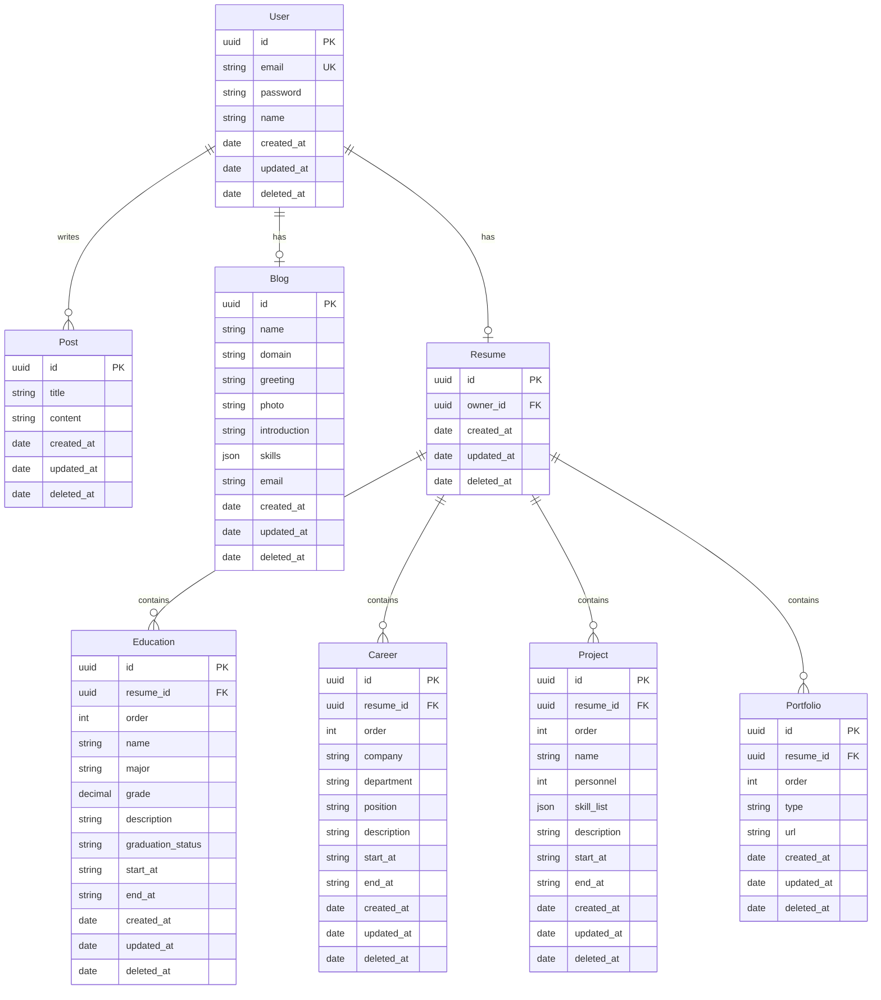

# Blue-Port 블로그 백엔드

> 블로그 서비스와 이력 관리 서비스를 같이 제공하는 커리어 관리 전용 블로그

## 📝 프로젝트 소개

이 프로젝트는 NestJS를 기반으로 한 블로그 백엔드 서버입니다.  
GraphQL을 사용하여 API를 제공하며, MySQL을 데이터베이스로 사용합니다.

## ✨ 주요 기능

- 👤 사용자 인증 및 권한 관리
- 📝 블로그 포스트 관리
- 📄 이력서 관리 (학력, 경력, 프로젝트, 포트폴리오)
- 📤 파일 업로드 기능
- 📊 로깅 시스템

## 📘 ERD 구조도



## 🛠 기술 스택

| 카테고리      | 기술             |
| ------------- | ---------------- |
| 프레임워크    | NestJS           |
| API           | GraphQL (Apollo) |
| 데이터베이스  | MySQL            |
| 인증          | JWT              |
| 파일 스토리지 | Cloudflare       |
| 컨테이너화    | Docker           |
| 로깅          | 커스텀 로거      |

## 🌿 브랜치 및 깃 전략

### 브랜치명 규칙

- **규칙**: `feature/{prod/main/dev}/{work}`
- **예시**: main 브랜치에서 user 작업을 한 경우
  ```
  feature/main/user
  ```

### 작업 순서

1. main 브랜치에서 작업 브랜치를 생성
2. 작업한 브랜치를 dev에 병합
3. 프론트/백엔드 작업 완료 시 main 브랜치에 병합
4. main 브랜치를 prod 브랜치에 병합
5. prod 브랜치 배포 후 깃 태그 추가
   ```bash
   git tag -a v0.0.1 {깃 해시} -m "{메세지}"
   ```
6. 생성한 tag를 remote에 배포
   ```bash
   git push smith v0.0.2
   ```

### 깃 태그 규칙

`v{MAJOR}.{MINOR}.{PATCH}`

- **MAJOR**: 호환되지 않는 API 변경
- **MINOR**: 기능 추가 (호환 유지)
- **PATCH**: 버그 수정 (API 변경 없음)

## 🚀 운영 및 배포

### 사용 기술

- Docker Compose
- Docker Hub
- GitHub Actions

### 배포 순서

1. dev 브랜치 푸시 시 GitHub Actions에서 Docker 이미지 빌드
2. 빌드된 이미지를 Docker Hub에 업로드
3. AWS Lightsail 인스턴스 접근 후 이미지 가져오기
4. Docker 이미지 실행

## 📋 개발 규칙

1. 주석은 최대한 라인마다 작성
2. Entity 역할 클래스는 Abstract Class로 선언하고, GQL InputType/ObjectType 클래스 구현
3. API 및 함수 이름은 CRUD 패턴 준수

## 💡 기술 노트

1. **SWC 컴파일러**: tsc보다 빠른 컴파일 속도
2. **로깅**: Async Local Storage를 활용한 request별 로그 관리
3. **에러 처리**: Wrapper 함수에서 통합 에러 처리

## 🚀 실행 방법

```bash
# 개발 환경
$ yarn run start

# 개발 모드 (자동 재시작)
$ yarn run start:dev

# 프로덕션 모드
$ yarn run start:prod
```

## ⚙️ 환경 설정

프로젝트는 다음 환경을 지원합니다:

| 환경  | 설정 파일    |
| ----- | ------------ |
| LOCAL | `.env.local` |
| DEV   | `.env.dev`   |
| PROD  | `.env.prod`  |

## 🔧 유용한 Docker 명령어

```bash
# 컨테이너와 이미지 전체 삭제
$ docker-compose down --rmi all

# 특정 환경 설정으로 이미지 빌드 및 실행
$ docker-compose -f docker-compose.dev.yml --env-file .env.dev up -d --build

# 인스턴스에서 도커 실행
$ docker-compose up -d app

# Docker Hub에서 이미지 가져오기
$ docker pull ${DOCKER_IMAGE_NAME}/app:latest

# 이미지 빌드
$ docker-compose build app

# Docker Hub 로그인
$ docker login

# 이미지 푸시
$ docker push ${DOCKER_IMAGE_NAME}/app:latest
```
