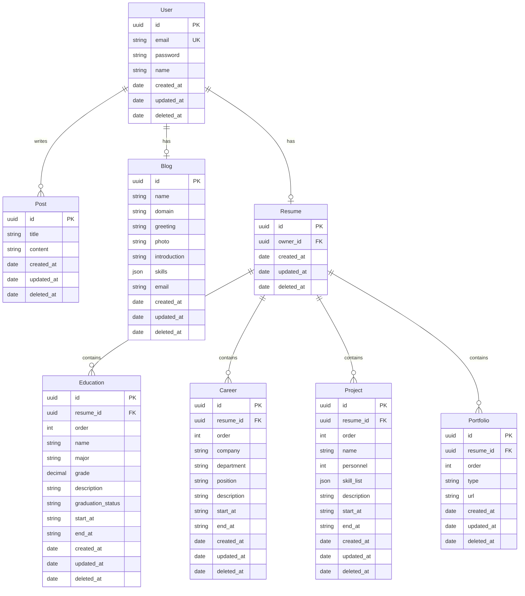

# blue-port 블로그 백엔드

이 프로젝트는 NestJS를 기반으로 한 블로그 백엔드 서버입니다.  
GraphQL을 사용하여 API를 제공하며, MySQL을 데이터베이스로 사용합니다.

**블로그 서비스와 이력 관리 서비스를 같이 제공하는 커리어 관리 전용 블로그**

## 주요 기능

- 사용자 인증 및 권한 관리
- 블로그 포스트 관리
- 이력서 관리 (학력, 경력, 프로젝트, 포트폴리오)
- 파일 업로드 기능
- 로깅 시스템

## 📘 ERD 구조도



## 기술 스택

- **프레임워크**: NestJS
- **API**: GraphQL (Apollo)
- **데이터베이스**: MySQL
- **인증**: JWT
- **파일 스토리지**: Cloudflare
- **컨테이너화**: Docker
- **로깅**: 커스텀 로거

## 브랜치 및 깃 버전 전략

### 브랜치명 규칙

1. 규칙: feature/{prod/main/dev}/{work}
2. 예시

```

main 브래치에서 user 작업을 한 경우
feature/main/user

```

### 작업 순서

1. main 브랜치에서 작업 브랜치를 딴다.
2. 작업한 브랜치를 dev에 병합한다.
3. 해당 내용의 프론트, 백 모두 작업이 완료된 경우 작업한 브랜치를 main 브랜치에 병합
4. main 브랜치를 prod 브랜치에 병합
5. prod 브랜치가 배포된 이후 깃 태그 추가

```

    git tag -a v0.0.1 {깃 해시} -m "{메세지}"

```

### 깃 태그 규칙

v{MAJOR}.{MINOR}.{PATCH}

1. MAJOR: 호환되지 않는 API 변경(기존 사용자 코드가 깨지는 경우)
2. MINOR: 기능 추가(호환 유지, 새 기능 추가, 기존 기능 위치)
3. PATCH: 버그 수정(사소한 수정, API 변경 없음)

## 운영 및 배포 방식

### 사용 기술

docker-compose, docker-hub, github-action

### 순서

1. dev 브랜치가 푸시되면, github-action에서 docker-compose로 docker 이미지를 빌드한다.
2. github-action에서 빌드된 이미지를 docker-hub에 업로드한다.
3. github-action에서 aws lightsail 인스턴스에 접근한 후, docker-hub에 로그인하여 해당 이미지를 가져온다.
4. github-action에서 aws lightsail 인스턴스에 접근해서 가져온 docker 이미지를 띄운다.

## Rule

1. 주석은 최대한 라인마다 작성
2. Entity의 역할을 하는 클래스는 Abstract Class로 선언하고 클래스를 상속받아 Gql의 InputType 클래스와 ObjectType 클래스를 구현
3. API 및 함수 이름은 최대한 CRUD를 살려서 선정

## Note

1. swc compiler - tsc보다 속도가 빠른 swc 컴파일러 적용
2. log - Async Local Storage를 이용해 request 별 로그를 작성하고, 각 함수를 감싸는 wrapper용 함수를 만들어 IO 로그의 중복 최소화
3. error - 각 클래스를 감싸는 wrapper 함수에서 함수의 전체 error를 감싸서 처리하고 있기 때문에, 특별히 따로 잡아야할 에러가 있는게 아니라면 전체를 관통하는 에러처리는 필요없음

## Running the app

```bash
# development
$ yarn run start

# watch mode
$ yarn run start:dev

# production mode
$ yarn run start:prod
```

## 환경 설정

프로젝트는 다음과 같은 환경을 지원합니다:

- LOCAL: 로컬 개발 환경
- DEV: 개발 서버 환경
- PROD: 프로덕션 환경

각 환경별로 다음과 같은 설정 파일이 필요합니다:

- `.env.local`
- `.env.dev`
- `.env.prod`

## 기타사항

```bash
# 기존 컨테이너와 이미지 모두 깨끗하게 삭제하고 싶을 때
$ docker-compose down --rmi all

# 특정 docker-compose 파일과 env 파일을 이용해 이미지를 빌드하고 백그라운드로 돌리기
docker-compose -f docker-compose.dev.yml --env-file .env.dev up -d --build

# 인스턴스에서 도커 띄우기
$ docker-compose up -d app

# docker-hub에서 빌드된 이미지 가져오기
$ docker pull ${DOCKER_IMAGE_NAME}/app:latest

# docker-compose를 이용해 이미지 빌드
$ docker-compose build app

# docker login
$ docker login

# 빌드한 이미지를 docker-hub에 푸시
$ docker push ${DOCKER_IMAGE_NAME}/app:latest

```
